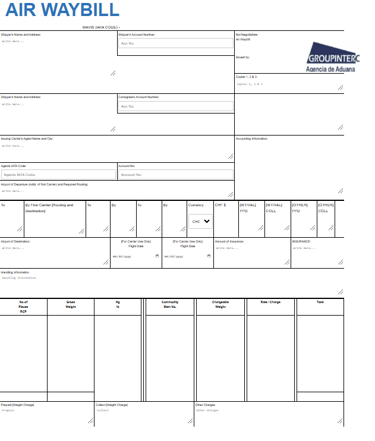

# AIR WAYBILL ✈️📄  

This project is a **highly responsive and professionally designed Air Waybill template** built with **HTML and CSS**, showcasing modern design principles and adaptability across all screen sizes. It includes an interactive layout and realistic styling that mimics the standard Air Waybill format, perfect for logistics, shipping, and air cargo services. 🚀✨  

---

## Features 🌟  

- **Responsive Design**: Fully optimized for desktop, tablet, and mobile views. 📱💻  
- **Pixel-Perfect Layout**: Replicates a professional Air Waybill with utmost accuracy. 🖼️📏  
- **Interactive Elements**: Fields are designed for easy input and are visually distinct for user convenience. 📝🖊️  
- **Customizable Template**: Easy to modify for various shipping and logistics requirements. ⚙️✂️  
- **Professional Aesthetic**: Sleek and formal design suitable for corporate environments. 💼🏢  

---

## Preview Demo 📸  

Below is a preview of the **Air Waybill webpage form** to showcase its design and layout:  

  

>

---

## Topics Covered 📝  

1. **HTML Structure**: Building a logical and accessible template using semantic HTML. 🏗️  
2. **CSS Styling**: Enhancing visuals with CSS for a clean and professional look. 🎨  
3. **Responsive Design Principles**: Implementing media queries for device adaptability. 🌐📐  
4. **Image Integration**: Seamlessly incorporating a logo and other graphical elements. 🖼️  
5. **Form Styling**: Crafting input fields and dropdowns that align with the overall design. 📋✅  

---

## Technologies Used 🛠️  

- **HTML5**: For semantic structure and layout. 🔧  
- **CSS3**: For stunning visuals and responsive design. 🎨  
- **Images**: For branding and realistic templates. 🖼️  

---

## How to Use 🚀  

1. Clone the repository.  
2. Open the `index.html` file in any modern browser. 🌐  
3. Modify the fields as needed for your specific logistics use case. ✏️  
4. Replace or update the logo or other graphical elements to fit your brand. 🖼️  
5. Use the **Preview Demo** to visualize the template!  

---

## Skills You'll Gain 💡  

- Crafting **responsive layouts** with HTML and CSS.  
- Designing professional-grade templates for **corporate use**.  
- Using **realistic design principles** for logistics documentation.  
- Implementing **form fields** that are intuitive and user-friendly.  

---

## Hashtags 🔖  

#AirWaybill #ResponsiveDesign #HTML5 #CSS3 #WebDesign #Logistics #CorporateTemplate #Freight #Cargo #ProfessionalDesign  

---

Thank you for exploring this **Air Waybill Project**! We hope it serves as a practical tool for your logistics and shipping needs. If you have any feedback or suggestions, feel free to reach out. 💬🌟  

--- 

This version includes a **preview demo section** where you can upload your webpage form screenshot to showcase how the project looks!